## The part where I am very bad at procrastination[^1]

[^1]: Just kidding, that's all of the parts, this is actually just an intro. But you totally believed me for a second didn't you?

Hello there dear reader. I don't know you and you don't know me, and you can't talk to me but I can talk to you, so I can fix at least one of those things.

If you haven't already read the whole page I wrote introducing myself, well that's kinda rude, maybe go do that?

You don't have to though, I mean you do you. It doesn't matter too much anyways.
The important things to know are the following:

- I'm a big fucking nerd
- I grew up on How to Train Your Dragon and I absolutely love it
- I'm handy with a computer

Anyways that concludes the preliminary knowledge section. We may now resume tonight's scheduled entertainment.

### Tonight's scheduled entertainment

So during my time at university (after a bit of a false start when a previous partner and I decided we
would do this, and then never did[^2]) I decided to try and recreate Astrid's dragon scale armour and axe.

[^2]: We both went on to each independently get diagnosed with ADHD, which really just explained an awful lot.

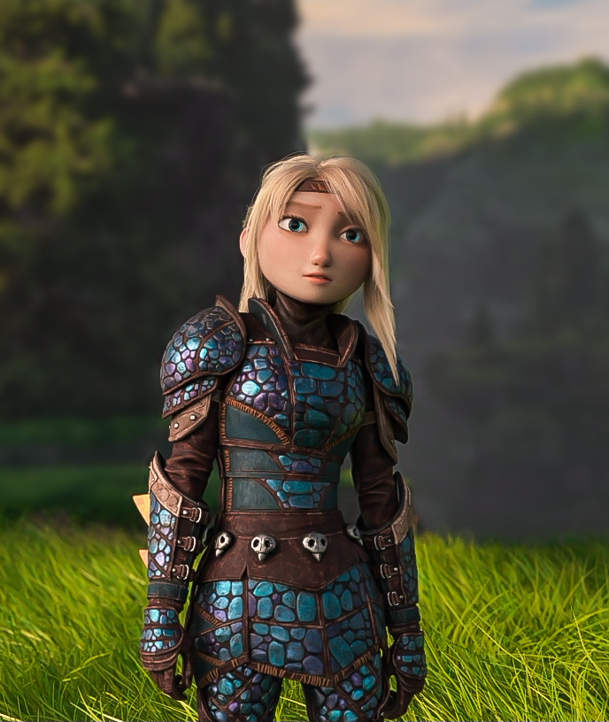
See doesn't this look cool as heck? Who wouldn't want armour like this?

I had no clue what I was doing going into this, and I'd never done anything like this before.
I did however know what I wanted to make, which helped a lot.
I started not with the armour but with her axe, as I thought it'd be a bit simpler[^3],
and also because I found a [handy tutorial](https://www.youtube.com/watch?v=MAgN2iGn2Uc) for it.

[^3]: "simpler" here is a **_very_** relative term.

## But wait... can I, a person who has never made an axe before, just make an axe?

Yes, you can! (kinda)

So, about now, I started working on the axe. I had no idea what I was doing, but I had something even better
than an idea of what I was doing - an unjustified amount of sheer fucking audacity.

First problem was sorting out a place to work on this, and tools to do it with, as I was living in uni accomodation at the time,
and thus had neither.

I reached out to my local on-campus makerspace [^4] to check if they were happy for me to be working
on this in their facilities (there was a no-weapons policy), and it turned out that they were, with the caveat that I show them
after I finished, because they thought it sounded cool.

[^4]:
    Reach out to your local makerspace if you haven't previously, they're almost always awesome,
    and full of very cool people.

That seemed like a pretty fair deal to me, so I got to work[^5].
[^5]: And by "got to work" I mean "purchased basic materials, left them in my room for about a year, remembered they existed, and then started working on things".

### Making an axe I guess

The axe was all done by hand following the tutorial linked above, so there isn't too much to remark about it process-wise.
You just kinda...

1. Get some foam, a whole bunch of it, ideally some kind of rigid foam sheet like XPS.
2. Cut it in an approximately axe-like shape.
3. In between these pieces, cut out space for a wooden dowel, and place it between them.
4. Glue two pieces together to make it even thicker and secure the wooden dowel.
5. Sand off the edges to not look like you hacked them out with a box cutter, and instead look like an axe blade[^6].
    [^6]: Remember to use a dust mask and ventilated space for this, lest you encounter the infamous "you just inhaled a shit load of extruded polystyrene dust" conditon.
6. Cut out a bunch of notches and grooves and scars in the foam.
7. Wrap the foam in thermoplastic, like worbla.
8. Spend a handful of hours considering the steps that led to this point in your life, and if this is really worth it, as you try to make worble not look like mess.
9. Somehow pull it together despite the last step.
10. Put a bunch of googly eyes on the axe head to look like rivets.
11. Paint the axe head.
12. Make a bunch of EVA-foam "leather" straps with plastidip and paint.
13. Put together an axe handle with these all at the very last minute.
14. Screw the handle into the dowel that I sure hope you remembered to include back at step 3.
15. Wow it's an axe!

It's pretty simple really, anyone can do it (I nearly quit halfway through several times and it took me multiple months of regularly working on it).

### Wow an axe!

With that done, you too, can enjoy your very own axe, suitable for:

- Slicing people ❌
- Bonking people ✅
- Chopping wood ❌
- Looking cool as fuck ✅

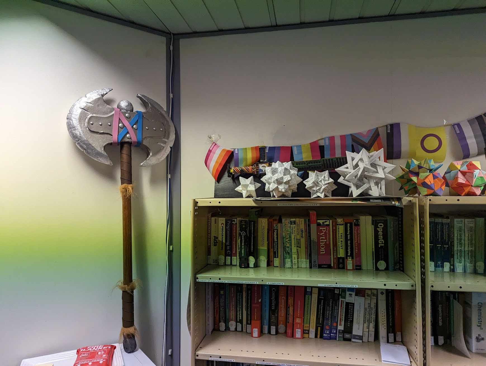
That's a cool-as-hell axe if you ask me.

## Ok wait, but I was promised cool armour. And lasers. That didn't use lasers :(

Yeah I know, I'm getting to that part.

### Ok but you're on thin ice you know...

Ok ok, guess I should probably start on that whole armour thing now then.

## Wow dragon scale armour? And lasers? Gadzooks!

Ok so some useful prerequisite conditions that I met that helped me with this:

- I was handy with computers
- I knew just enough about blender to follow random blog posts
- I had ADHD

So basically, I knew I needed to model out the armour pieces somehow in 3d.
I had a bunch of reference images, but I had no idea how to make a pattern for foam/fabric, and 3d-modelling seemed a lot more practical.

I stumbled on this [awesome tutorial](https://youtu.be/wRBk9npIevQ) from Kamui Cosplay about a process for taking meshes in blender and making paper patterns from them.
It's a really great video, and if you're interested, you should watch it.

Anyways, I had a crack at working on things using the stuff in this video.

First, I got a friend to help me out with getting a 3d scan of myself. Actually my ex, the one I originally planned to do this with.
I took so long to build the axe that in the time it took to get to this point, we had broken up twice, and finally gotten back together as really good friends.
And I'm not fast with those things, the axe just took that long[^7].
[^7]: Mostly due to procrastinating on it.

I used their phone's LIDAR scanner to capture a model of myself, and then I set myself the daunting (heavy sarcasm) task of watching through HTTYD: THW again to get a bunch of reference images.
I took a bunch of screenshots of the dragon scale armour, and then I used those to model out the pieces in blender.

I started with a pauldron, as I figured it'd be nice and simple. I meshed it out, and then translated it to something I could plot in 2d using the instructions from Kamui's tutorial video.

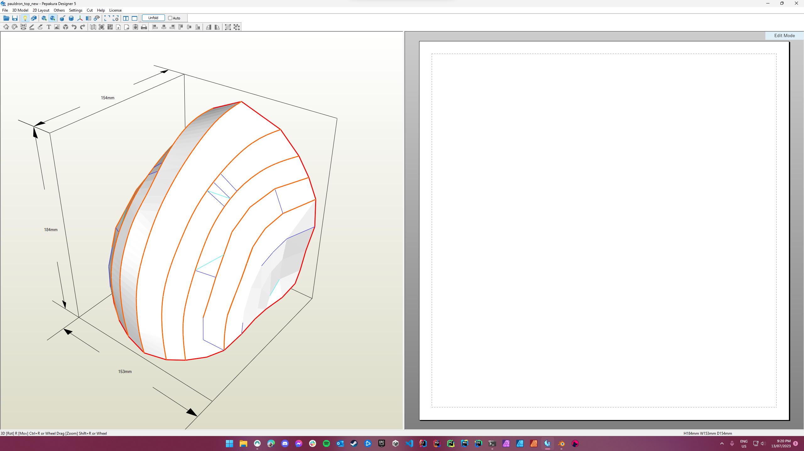
You might end up with something that looks like this.

Then I unfolded the model and realised I had nothing to plot it with.
I could just use a printer from campus, but then I'd have to wait until I was on campus, and it was a weekend.

### Printers are for chumps, real nerds use ~~lasers~~ vinyl cutters

Haha that's right, you thought you were up to the lasers part, didn't you?
You fool, that's later down this page. This is the "I hack a pen into a vinyl cutter" part.

Anyways so yeah my housemate had an old roland gs-24 lying around that they weren't using, and I asked if they were cool with me messing with it and they said yes.

So I pulled apart the blade, found a 3d model online for a pen attachment, printed that, found it didn't work, and then just kinda filed it off and wedged the pen in until it did work.

After you've done that, your vinyl cutter is actually now [a perfectly functional printer](https://www.youtube.com/watch?v=1s8Y4LFFU0o)[^8].
[^8]: As long as what you want to print is entirely composed of lines.

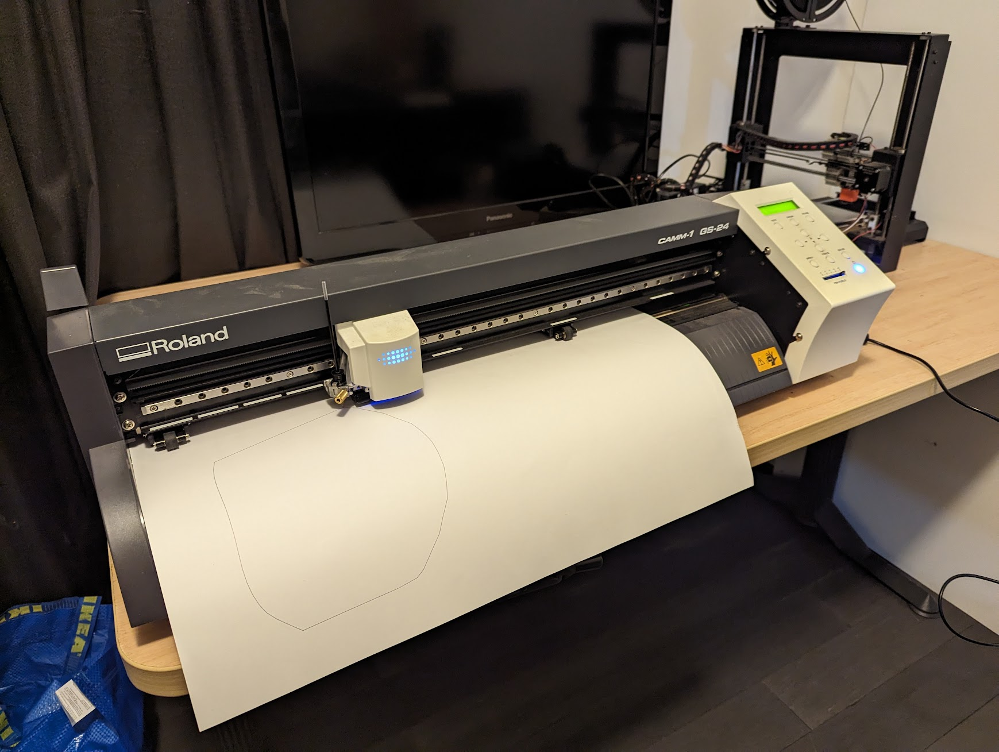

### Cool so you've got the shape, now what?

Just cut it out of foam, right? Well yes, but actually no.

You do need to cut it out of foam, but because 3d shapes don't map well to 2d shapes[^9], you would have needed to make lots of smaller pieces when you unfolded it in pepakura.
[^9]: If did were then this would all have been a heck of a lot easier lol.

So from here, you need to spend a bunch of time cutting the pieces out individually, and then gluing them together with contact cement.

But once you've done that, then yes, you just cut it out of foam.

Then you can draw some funky circles[^10] on top like this:
[^10]: Emphasis on the funky, these are not normal circles. If your circles look like circles, you did it wrong.

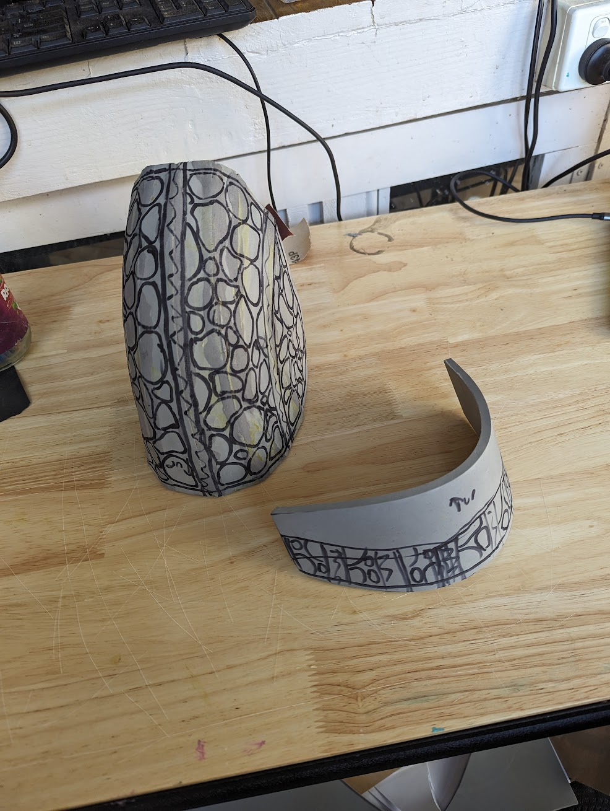

And then to make those circles look like scales, you can grab a soldering iron, ideally one you don't like, and go at it.
EVA foam burns really easily so you can just slice through the foam[^11].
[^11]: It's really really satisfying to do :D

### Wait but isn't that toxic?

Oh yeah, extremely toxic. Seriously don't do this without a good VOC respirator, and do it outside.

### Ok I've got a respirator now, so can continue.

Ok good, wouldn't want you to die or anything.
Idk you probably wouldn't die... maybe. But it wouldn't be good for you.

Anyways, once you've cut out all of the scales, you can once again cover that foam in plastidip[^12] and then paint it.
[^12]: Plastidip makes everything better 😍 Except food, don't plastidip your food

If you find some nice iridescent paint, you can make it look like dragon scales.

All you need to do from there is cut out some extra strips of foam, plastidip them, paint them brown, and glue then on for a bit of extra detail.

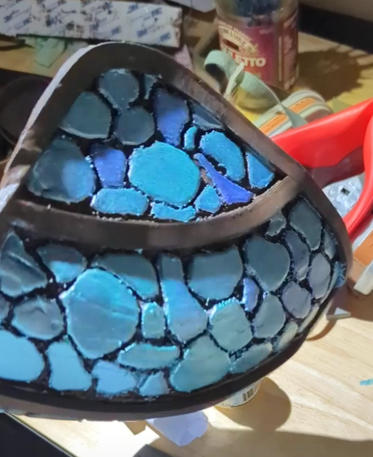
The photo doesn't quite do it justice, but just imagine those scales are super shiny and sparkly in real life.

## Ok wait but that sounds like an awful process

Yeah it is. The soldering takes a couple of days, and that's just for one piece. It would really suck to do the entire thing this way, plus when you look up close, it's really messy.

I started thinking about better solutions, and remembered laser cutters exist.

One big problem with laser cutters though is that they're really expensive. Fortunately not a problem however, because I could use the one at the uni's makerspace.

The other problem was that I had to somehow have the scales included in the design that I put into the laser cutter, if I wanted to etch the scales.

This was super tricky, because I couldn't really just paint them on after the fact, when my SVG file was a bunch of small disconnected strips.

Instead, I needed a way of somehow creating them almost on the 3d shape that the pieces would eventually become, and then splitting them apart, but how would that work...

### Really obvious plot twist

Yep that's right, because we're already using a 3d model in blender, we can just hack together a shader system to do this, bake it into a texture, and then cut that out.

I found a tutorial that explained how to make a cobblestone shader in blender using voronoi spaces, and modified things from there to get the effect I wanted.

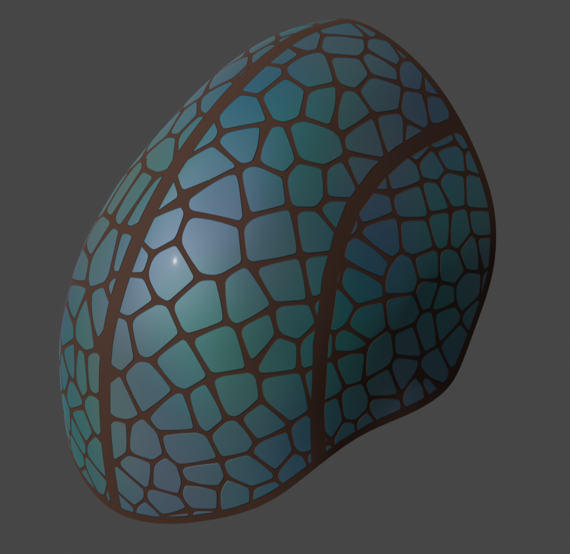

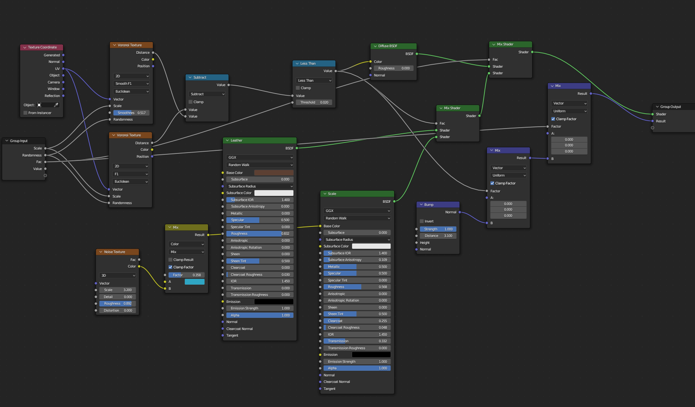
I love blender shaders, they're so much fun to play with.

Then you just have to unwrap the model's UVs and bake the material into a texture.
Fortunately you don't really have to worry about the UVs too much as long as none of the bits overlap, because any distortions will get corrected back out in the end.

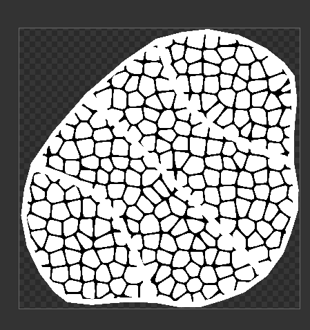

Then you can just make sure that you export the texture with your model and pepakura can read it from there!

But there's another issue. We want to be able to exclude parts of the model from scales to add things like detailing.
Well luckily blender has a really awesome system called "geometry nodes" where you can do fun things based on 3d data and geometry.
For instance, you could create a second object from lines where the scales would get skipped within a certain distance of those lines.

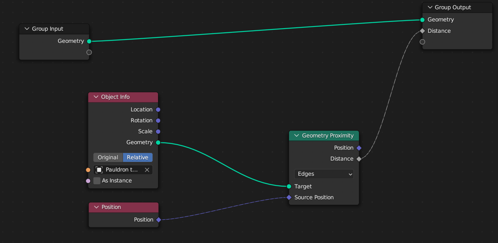
This just calculates the distance from the current point to a second object.

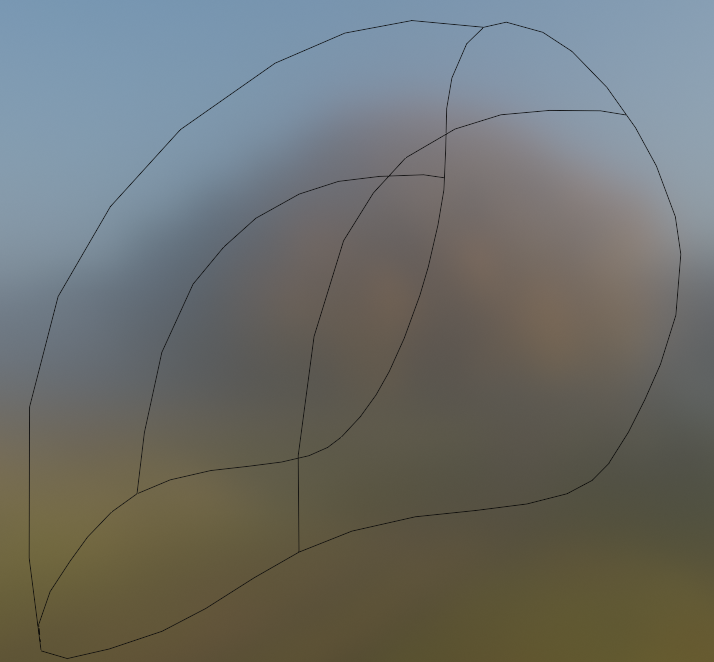
We can draw out lines like this for ares we want to skip.

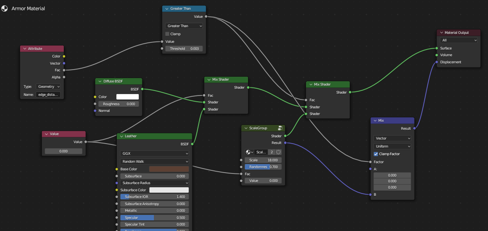
And then you can take the distance data from the geometry nodes and use it to filter the material that creates the scales.

Then with that, you can export the model and the texture together and import it into pepakura, and then export them together into an SVG file for cutting.

## So... laser time?

Laser time!

It isn't quite just "export and go", you need to do a bit of work and cleanup still, and I like to manually go over the texture output and clean up the edges for neatness, but then yes, you're ready to go!

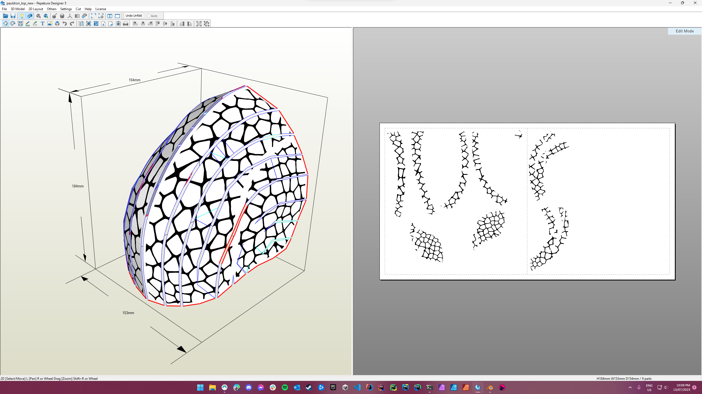

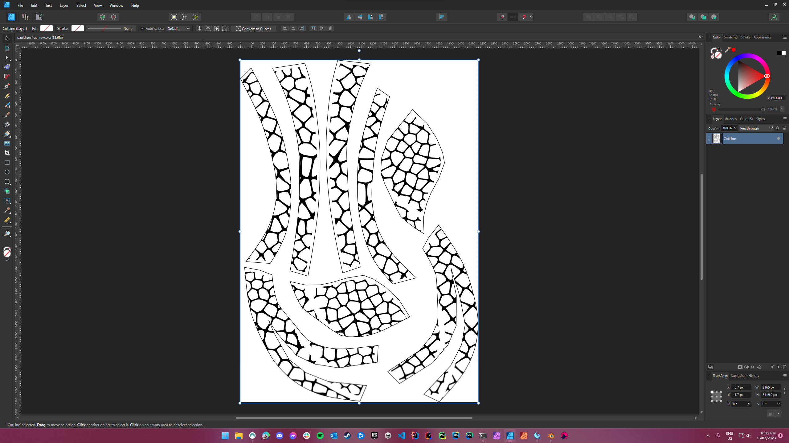
With a little bit of cleanup, you can get a nice neat SVG file like this.

Then you just load it into your laser cutter (after tunning it to the foam you're using), and cut it all out!

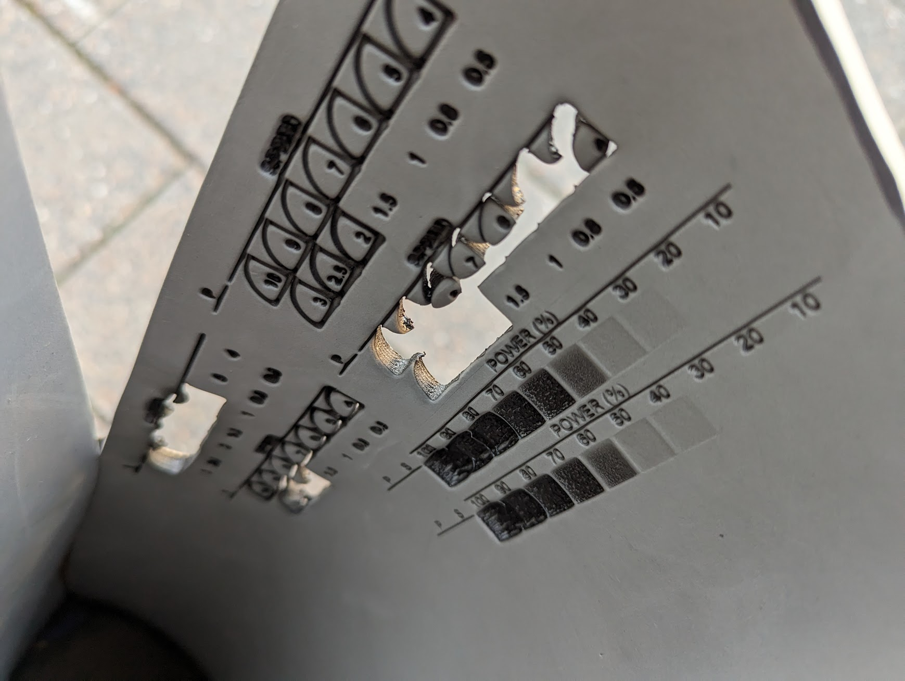
The laser cutter tuning is an interesting process, you just cut stuff out at different speeds and powers until you find the right mix. Sometimes things catch on fire too, which is fun.

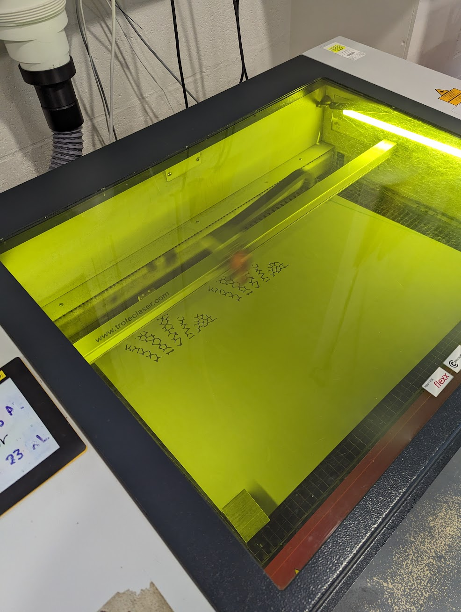
Wooo lasers! Finally!

Using a laser cutter means the resulting pieces are all super cleanly cut, way nicer than you can get by hand.

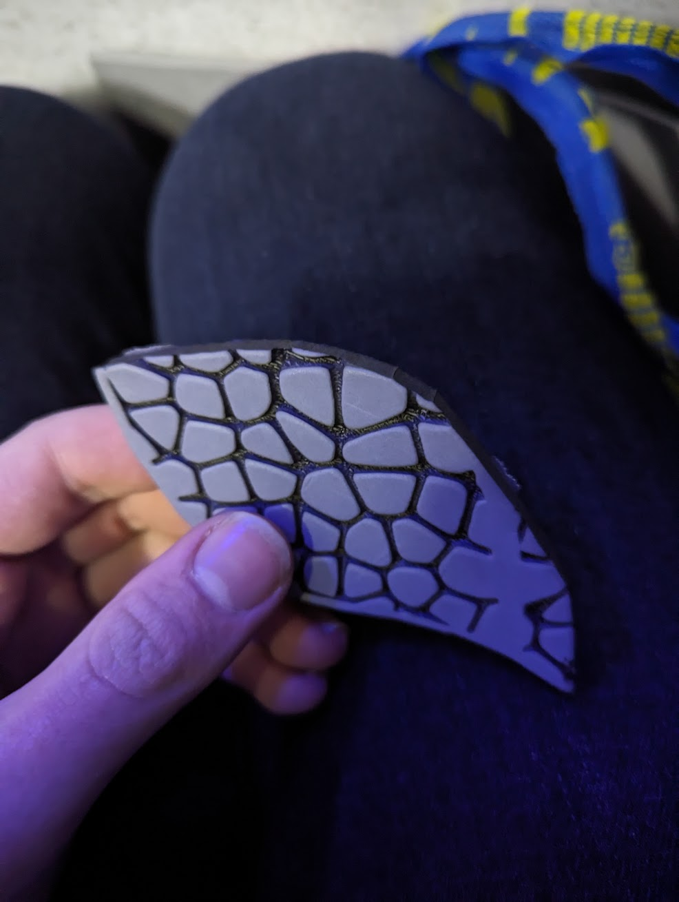
Look at how even the gaps between the scales are! It's so nice!!

Then you just need to glue it all together, as before, and you can have an awesome looking pauldron like this:

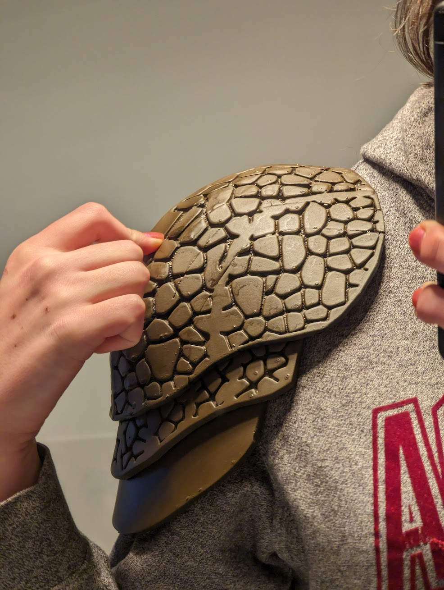
This is a test piece, so it doesn't have the detailing on it yet, but you can see how nice and clean the edges and scales all are.

## So what about the rest of the armour?

The rest of the armour is pretty much the same process, unfortunately, life has gotten in the way so far, and I haven't gotten around to finishing it 
yet, but I still want to, and hopefully one day I'll be able to get a laser cutter (I'm not at uni anymore) and do that!

In the meantime though, hopefully this has been a fun little adventure, and maybe you can take some of the ideas and use them for your own projects!

### Maybe I tie this all into some nice conclusion?

So yeah, this whole adventure was a mess, but really awesome and I think it worked out well. It was super fun too.

I think the coolest thing about it was just getting to pull together so many different skills and tools to make something unique and learn.

I think if there's anything that I could wholeheartedly recommend to people out there in the wide world, it'd be that.

The best things you'll ever make, and the best learning you'll ever do, is going to be when you're throwing yourself head-first into a cool idea with nothing more than a dream and a couple of random tutorials.
You don't need to know everything upfront, and you don't need to be an expert in any one thing.
Often the coolest stuff can come from taking a little bit of all of the things you know and sprinkling them together in a way that makes sense to you.

I think that sort of thing is really awesome, and it brings me a lot of joy to be able to do that. Maybe it'll bring you joy too.

So go out there, and make something cool. I believe in you. :)